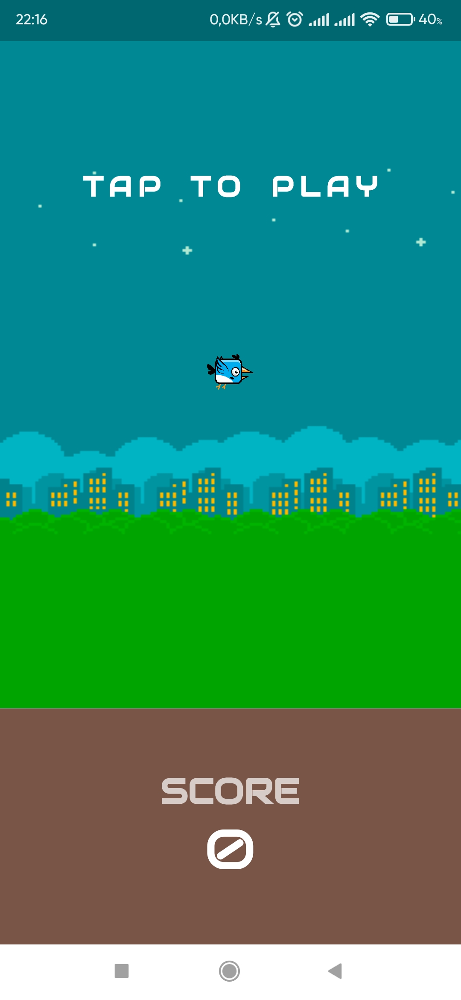

# Entertainment App With Mini Game - MiniGapp

This software help you to have a great entertainment time through some mini game that provided by us
- **OFFLINE** - **NO ADS**

## Features

All Video about gameplay are in [resource folder](resource)

**1. Dino Run**

Start|Mode|Play
:-------------------------:|:-------------------------:|:-------------------------:|
||

**2. 2048**

Play|Mode
:-------------------------:|:-------------------------:|
|

**3. Flappy Bird**

Play|
:-------------------------:|
|

**4. SpaceScape**

Start|Mode|Play
:-------------------------:|:-------------------------:|:-------------------------:|
||

**5. Mini Guess**

Play|
:-------------------------:|
|

**6.Camera AR Filter**

Filter|Masked
:-------------------------:|:-------------------------:|
|

## Getting Started

This project is a starting point for a Flutter application.

A few resources to get you started if this is your first Flutter project:

- [Lab: Write your first Flutter app](https://docs.flutter.dev/get-started/codelab)
- [Cookbook: Useful Flutter samples](https://docs.flutter.dev/cookbook)

For help getting started with Flutter development, view the
[online documentation](https://docs.flutter.dev/), which offers tutorials,
samples, guidance on mobile development, and a full API reference.

### Installing

Before run app you should install [Flutter](https://docs.flutter.dev/get-started/install) and [Dart](https://dart.dev/get-dart)

## Running

You can run app with

    flutter run

### Prerequisites

You should do this task bellow to run all features of our app

Task: Import file for deepAr because we use [DeepAR](https://www.deepar.ai/) in our app
1. Access this link bellow
   %LOCALAPPDATA%\Pub\Cache\hosted\pub.dartlang.org\deepar_flutter-0.0.3\android
   or if above not working
   %LOCALAPPDATA%\\Pub\Cache\hosted\pub.dev\deepar_flutter-0.0.3\android

2. Copy folder libs (contains file deepar.arr) into the linked folder above

## Authors

- **[Cao Nguyễn Minh Quân](https://github.com/minhquancn18)**
- **[Nguyễn Doãn Thịnh](https://github.com/thinhhja2001)**

## Resources

- [Dino Run](https://www.youtube.com/playlist?list=PLiZZKL9HLmWOmQgYxWHuOHOWsUUlhCCOY)
- [2048](https://medium.com/@angjelkom/making-2048-game-in-flutter-44186a8ca89c)
- [SpaceScape](https://www.youtube.com/playlist?list=PLiZZKL9HLmWPL0URlq9WLng1A_g1LDuxx)
- [Flappy Bird](https://www.youtube.com/watch?v=vgmVPpFP0fI)
- [Camera AR Filter](https://pub.dev/packages/deepar_flutter)
